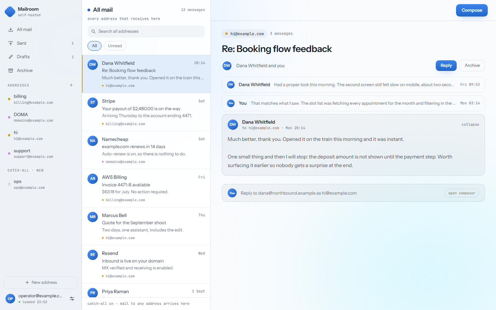

# Mailroom

Self-hosted email client. Receives through [Resend Inbound](https://resend.com/features/inbound)
or [Cloudflare Email Routing](https://developers.cloudflare.com/email-routing/).

<picture>
  <source media="(prefers-color-scheme: dark)" srcset="docs/screenshot-dark.png">
  
</picture>

Receives mail for a whole domain, threads it, and sends replies from any address
on that domain. Mail is stored in your own Postgres.

Point your domain's MX record at Resend and every address works immediately. An
inbox in Mailroom is a filter over stored mail, so a new address shows up in the
sidebar the first time somebody writes to it.

- Catch-all receiving for the whole domain
- Threading from `In-Reply-To` and `References`, with a subject and participant
  fallback for clients that omit them
- Full-text search over subjects and bodies
- New mail appears in open tabs without a reload
- Attachments on the filesystem, S3-compatible storage, or in Postgres
- Reply from the address a message was sent to, or compose from any of them
- A copy of every message forwarded to another address
- Password login with mandatory two-factor and recovery codes

Resend exposes no IMAP or SMTP mailbox, so Mailroom is the only client for this
mail. Set `FORWARD_TO` to send a copy of every message to another address. There
is no spam filtering: catch-all means you get everything sent to the domain.

I built this for myself because I was tired of sending emails through cURL, and
Cloudflare Email Routing can't reply to emails.

It's open source in case anyone else finds it useful lol.

## Try it without a domain

You don't need a domain or any DNS changes to see it work. Resend gives every
account a receiving subdomain that is catch-all out of the box.

1. Clone it and install the dependencies.

   ```sh
   git clone https://github.com/Shortink/mailroom.git
   cd mailroom
   npm install
   ```

2. Copy the example config, then fill in your Resend API key and the two
   secrets.

   ```sh
   cp .env.example .env
   node -e "const r=n=>require('crypto').randomBytes(n).toString('hex');console.log('SESSION_SECRET='+r(32));console.log('RECONCILE_TOKEN='+r(32))"
   ```

   Paste those two lines over the empty ones in `.env`, and put your Resend key
   in `RESEND_API_KEY`. The key needs Full access.

3. Resend delivers inbound mail by webhook, so it needs a public HTTPS URL.

   ```sh
   ngrok http 3000
   ```

   Put the URL it prints in `APP_URL`.

   A free ngrok account includes one static domain. `cloudflared tunnel --url
   http://localhost:3000` works too and needs no signup.

4. In the Resend dashboard, create a received mail webhook pointing at
   `<APP_URL>/api/webhooks/resend`, and put its signing secret in
   `RESEND_WEBHOOK_SECRET`.

5. Start the app.

   ```sh
   docker compose up
   ```

   Without Docker, point `DATABASE_URL` at any Postgres (Supabase, Neon,
   Railway, or a local install) and run `npm run db:migrate && npm run dev`.

6. Open the app. It prints a setup token to the logs on first boot; use it at
   `/setup` to create your account.

7. Send mail to your Resend receiving address, found under Emails > Receiving in
   the dashboard.

Sending from `onboarding@resend.dev` works with no verified domain, but only to
the address you signed up to Resend with. Anything else comes back as a 403.
That is enough to watch a reply leave before touching DNS; sending to real
recipients needs the steps below.

## Connecting your domain

1. Add the domain in Resend and add the DKIM and SPF records it gives you. This
   is what allows sending as `you@yourdomain`. See
   [Resend's domain guide](https://resend.com/docs/dashboard/domains/introduction).
2. Enable receiving on the domain and add the MX record, which must have the
   lowest priority value of any MX record on the domain. See
   [Resend's receiving guide](https://resend.com/docs/dashboard/inbound/introduction).
3. Point the Resend webhook at your real `APP_URL`.

If you use Cloudflare Email Routing on the same name, it has its own MX records
there. Disable it as you add Resend's, or mail will keep going to Cloudflare.

MX records belong to one hostname, so routing on `example.com` and Resend
receiving on `mail.example.com` never compete. Putting Mailroom on a subdomain
is the way to run it against real mail without touching the address you already
use.

### Scoping the API key

Resend keys carry a permission and an optional domain restriction, both set
when you create the key.

**Full access.** A Sending access key can post a message but can't read one
back, and both halves of Mailroom read.

Receiving through Resend fetches the body and attachments from the API after
the webhook, which carries the envelope only. With a sending-only key, mail
arrives with nothing in it.

Sending reads the message back to learn the `Message-ID` the server assigned,
which is the header a reply quotes to thread against. With a sending-only key
the message goes out and is delivered, but the read is refused, so it never
completes: it stays pending until it runs out of attempts, and a reply to it
threads by subject rather than by header. This applies however you receive,
Cloudflare included.

You can restrict the key to the domain you send from. The restriction doesn't
affect receiving.

Rotating the key is a restart with a new `RESEND_API_KEY`. Nothing is stored
against the old one; inbound mail already in Postgres stays readable, since
attachment bytes are downloaded during ingest rather than fetched on demand.

## Receiving through Cloudflare instead

Resend accepts whatever is sent to the domain. Cloudflare Email Routing checks
SPF and DKIM first and refuses mail that fails both, so a forged sender never
arrives. It also forwards the original message intact, where Mailroom's own
forwarding has to send a new one from your address. If the domain is already
on Cloudflare, this is the better way in. Sending still goes through Resend,
and still needs a Full access key.

The worker posts the whole message, so the app needs a host that accepts a
25 MiB request body. Vercel and Lambda-based hosts cap it at a few megabytes and
would bounce anything larger, so on those receive through Resend instead: its
webhook is a small envelope and the body is fetched afterwards.

1. Generate a secret and put it in `.env` as `INBOUND_SECRET`.

   ```sh
   node -e "console.log('INBOUND_SECRET='+require('crypto').randomBytes(32).toString('hex'))"
   ```

2. Deploy the worker and give it the same secret, the app's public URL, and
   optionally the address that should receive a copy of everything.

   ```sh
   cd worker
   npx wrangler deploy
   npx wrangler secret put INBOUND_SECRET
   npx wrangler secret put APP_URL
   npx wrangler secret put FORWARD_TO
   ```

3. In the Cloudflare dashboard, enable Email Routing on the domain and add the
   MX records it gives you. Set the catch-all action to "Send to a Worker" and
   pick `mailroom-inbound`.

4. Leave `FORWARD_TO` out of `.env`. The worker forwards instead, with the
   sender's own signature still on the message.

Both ways in can be configured at once; each message arrives by whichever one
the MX record points at.

## Configuration

| Variable | Required | Notes |
| --- | --- | --- |
| `DATABASE_URL` | without Docker | Any Postgres. Docker brings its own unless this is set. Behind a pooler, use the pooled connection string. |
| `APP_URL` | yes | Public HTTPS URL. Resend delivers webhooks here. |
| `SESSION_SECRET` | yes | 32+ characters. |
| `RESEND_API_KEY` | to send or receive | Full access. Sending access can't read a message back, which sending and receiving both need. See [Scoping the API key](#scoping-the-api-key). |
| `RESEND_WEBHOOK_SECRET` | to receive through Resend | Signing secret of the received-mail webhook. |
| `RECONCILE_TOKEN` | for reconcile calls | Bearer token for `/api/tasks/reconcile`. 32+ characters. |
| `FORWARD_TO` | no | Address that receives a copy of everything. Leave unset when receiving through Cloudflare; the worker forwards instead. |
| `INBOUND_SECRET` | to receive through Cloudflare | Shared with the worker. 32+ characters. |
| `STORAGE_DRIVER` | yes | `fs`, `s3`, or `postgres`. |
| `FS_STORAGE_PATH` | with `fs` | Directory for attachments. |
| `S3_BUCKET`, `S3_REGION`, `S3_ENDPOINT`, `S3_ACCESS_KEY_ID`, `S3_SECRET_ACCESS_KEY` | with `s3` | `S3_ENDPOINT` covers R2, MinIO, and Backblaze. |
| `REQUIRE_TOTP` | no | Defaults to true. Set `false` only while testing. |
| `SETUP_TOKEN` | no | Fixes the first-run token instead of generating one per boot. |

## Deploying

### Managed hosts

Use Postgres from Neon or Supabase and the `s3` driver against R2, because these
platforms have no writable filesystem. Receive through Resend and point its
webhook at `<APP_URL>/api/webhooks/resend`; the Cloudflare worker posts whole
messages, which these hosts cap at a few megabytes.

Hosts that cap how long a response may run will drop the stream that carries new
mail to open tabs. Mail still arrives; it shows on the next navigation rather
than on its own. Hosts that cap the size of a response (4.5 MB on Vercel) cannot
serve an attachment larger than that.

### Docker

`docker compose up -d` runs the app and Postgres, with attachments on a mounted
volume. Migrations run at container start. You still need a public HTTPS URL, so
put it behind a reverse proxy:

```caddyfile
mail.yourdomain.com {
    reverse_proxy localhost:3000
}
```

### Reconciliation

Ingest completes out of band, so anything left pending is work that never came
back. Mailroom retries it on its own, about a quarter of an hour after the
attempt that stalled, which covers the Docker and VPS deployments with nothing
to set up. The wait is deliberate: a message with large attachments can take
minutes to fetch, and picking it up too early would send the forwarded copy
twice.

Hosts that freeze the process between requests can't run that timer. There
`/api/tasks/reconcile` does the same sweep on demand; call it every ten minutes
or so with the bearer token:

```sh
curl -X POST -H "Authorization: Bearer $RECONCILE_TOKEN" \
  https://mail.yourdomain.com/api/tasks/reconcile
```

Any scheduler works: a platform cron, a systemd timer, or a plain crontab.

## How it works

Inbound webhooks carry metadata only. The handler verifies the Svix signature,
writes a `pending` message, and returns 200 immediately, then fetches the body
and attachments afterwards. Returning early matters because Resend retries any
non-2xx, and a slow fetch would otherwise produce duplicate deliveries. A unique
constraint on the Resend message id makes retries harmless in any case.

Mail received through Cloudflare arrives whole. The worker posts the raw
message, the app parses it and finishes everything inside that request, and a
non-2xx makes Cloudflare try again a few times before bouncing the sender. So
there is no `pending` state on that path and nothing for the sweep to pick up.

Attachment download URLs expire, so the bytes are copied into your storage at
ingest rather than linked. Old mail keeps its files.

A message whose content fetch fails stays `pending` and stays visible rather
than being hidden. The reconcile sweep retries it with backoff until it
succeeds, or marks it failed after five attempts.

Outbound mail is briefly incomplete by design. Resend assigns the real
`Message-ID` and only exposes it after delivery, so a sent message is stored
`pending` and completed once that id can be read. Until then, replies to it
thread by the subject fallback.

Incoming HTML is cleaned on the server before it is shown, then rendered inside
a sandboxed iframe so it cannot reach the rest of the page. Remote images stay
out until you ask for them, because loading one tells the sender your address is
real.

## Development

```sh
npm install
npm run db:migrate
npm run seed        # sample mail, so there is something to look at
npm run dev
npm test
```

Tests truncate every table and so run against a separate database, derived by
suffixing your `DATABASE_URL` with `_test` or set explicitly through
`TEST_DATABASE_URL`. Create it once:

```sh
createdb mail_test
```

The name follows `DATABASE_URL`. With the `.env.example` default it's
`mail_test`; against a database called something else, suffix that name instead.

## Licence

MIT
